# 操作系统实验报告

## 实验基本信息

| 项目 | 内容 |
|------|------|
| **实验名称** | Lab1：最小可执行内核 |
| **小组成员** | 2414034-丁欣怡、2412604-刘泽民、2412591-贺翰林 |
| **完成日期** | 2026-10-08 |

### 小组分工

| 成员 | 负责的练习/模块 |
|------|----------------|
| 2414034-丁欣怡 | 练习一：理解内核启动中的程序入口操作 |
| 2412604-刘泽民 | 练习二：使用 GDB 验证启动流程 |
| 2412591-贺翰林 | 整合两份报告，撰写整体逻辑分析与总结 |

两位组员分别完成各自练习的技术内容、调试记录与截图；组长负责统一格式、梳理本章整体逻辑主线、补充四个分析问题，并统一定稿。

---

## 一、实验目的

本实验的主要目的是：

1. 理解 RISC-V 平台从加电复位、经固件初始化，到内核第一条指令执行的完整控制权交接过程。
2. 掌握内核入口汇编的作用：在内核尚无运行环境时建立自己的启动栈，并从汇编移交给 C 初始化函数。
3. 学会使用 GDB + QEMU 在裸机层面跟踪、反汇编并验证启动流程中的寄存器与内存变化。
4. 学习使用 AI 工具辅助阅读操作系统启动代码、定位困惑点并组织调试结论。

---

## 二、实验环境

使用的 AI 工具

| 成员 | AI 编程工具 | 底层模型 | 备注 |
|------|------------|---------|------|
| 2414034-丁欣怡 | Codex | gpt-6 | 源码分析 |
| 2412604-刘泽民 | Codex | gpt-6-Luna | GDB 调试记录整理 |
| 2412591-贺翰林 | Claude Code | deepseek-flash | 报告整合与分析 |

- 运行环境：WSL2（Ubuntu 24.04）、QEMU 4.1.1（`qemu-system-riscv64`, `virt` 平台）、`riscv64-unknown-elf-gdb`

---

## 三、实验整体逻辑分析

### 3.1 本章节的逻辑主线

本章围绕一个核心主题展开：**裸机环境下，内核如何把控制权从硬件固件逐步交接到自己手中，并首次运行起 C 代码**。也就是说，它解决的是"内核还没有任何运行环境时，如何自己把自己'扶起来'"这一问题。

整个启动过程可以划分为两个层面、四个阶段：

```text
硬件固件层：  复位(0x1000) → 复位引导代码 → OpenSBI 固件(0x80000000)
内核自举层：  内核入口 kern_entry(0x80200000) → C 初始化 kern_init → 运行
```

逻辑主线是"自底向上、由外到内"：先由硬件和固件完成最底层的准备与交接，再由内核入口汇编建立运行前提（栈），最后进入 C 语言的高级初始化。本章两个练习正好对应这条主线的不同尺度——练习一聚焦内核入口的两条指令（微观），练习二跟踪从复位地址到内核入口的完整链路（宏观）。

### 3.2 功能的逐步实现

本章实验按以下顺序逐步展开，每一步都是下一步的前提：

1. **首先理解硬件复位与固件交接**（练习二覆盖）→ 为什么先做这个？因为内核代码根本不是在开机瞬间就开始跑的，CPU 先执行的是平台固件。QEMU 的 `virt` 平台复位后 PC 为 `0x1000`，执行 ROM 中的复位引导代码，准备好设备树地址、hart 编号和固件入口地址，再跳到 `0x80000000` 进入 OpenSBI。只有先搞清楚"内核是从哪里被交接过来的"，后面的入口分析才有上下文。

2. **接着确认内核入口地址**→ 内核被链接并加载在固定地址 `0x80200000`（由 `tools/kernel.ld` 的 `BASE_ADDRESS` 与 `ENTRY(kern_entry)` 决定，并由 QEMU 的 `-device loader` 加载）。这是固件向内核交接的目标地址。

3. **然后实现内核启动栈的建立**（练习一覆盖）→ 内核刚接手时，栈指针可能还指向固件使用的内存，不能直接跑 C 代码。因此 `entry.S` 的第一条语句 `la sp, bootstacktop` 先让内核拥有自己预留、对齐的栈。为什么顺序上必须靠前？因为**栈是任何 C 代码运行的前提**——函数调用、保存返回地址、保存寄存器、存放局部变量都要用栈。

4. **最后从汇编移交给 C 初始化函数**（练习一覆盖）→ `tail kern_init` 以尾调用方式进入 C 函数。进入 `kern_init` 后，先清零 BSS 段，再输出启动信息，最后进入循环。至此内核完成了从"裸机汇编"到"C 运行环境"的过渡，启动流程形成闭环。

顺序的合理性在于：**先认清控制权的来源（固件→内核），再为内核建立最基础的运行条件（栈），最后才进入需要这些条件的高级初始化（C 函数）**。

### 3.3 各功能的核心函数与模块理解

| 功能 | 核心函数/模块 | 所在文件 | 作用 |
|------|--------------|---------|------|
| 内核定位与加载 | 链接脚本 `ENTRY(kern_entry)`、`BASE_ADDRESS` | `tools/kernel.ld` | 指定 ELF 入口符号与内核链接/运行地址 `0x80200000` |
| 内核入口 | `kern_entry` | `kern/init/entry.S` | 建立启动栈、移交到 C 初始化函数 |
| 内核启动栈 | `bootstack` / `bootstacktop`（`.data` 段预留 `KSTACKSIZE`） | `kern/init/entry.S` | 预留 8 KiB 内核栈，`bootstacktop` 为其高地址边界 |
| C 初始化 | `kern_init` | `kern/init/init.c` | 清零 BSS、输出启动信息、进入循环 |
| 启动输出 | `cprintf` / `vcprintf` → `cons_putc` → `sbi_console_putchar` | `kern/libs/stdio.c`、`kern/driver/console.c`、`libs/sbi.c` | 在尚无完整驱动时，经 SBI 调用完成内核早期打印 |
| 复位引导（练习二） | ROM 中 `reset_vec` 五条指令 | QEMU `hw/riscv/virt.c` | 准备设备树地址、hart 号、固件入口并跳转 |

**`kern_entry`（内核入口）** 是本章的核心。它只做两件事：`la sp, bootstacktop` 把预留栈的高地址边界（本构建为 `0x80203000`）写入栈指针，使内核获得一份对齐、可用的栈；`tail kern_init` 把控制权交给 C 初始化函数，且不写入返回地址（`ra`）。

**`kern_init`（C 初始化）** 是内核的第一段 C 代码。它先 `memset(edata, 0, end - edata)` 清零 `.bss` 段（保证未初始化全局变量为 0），再用 `cprintf` 打印 `(THU.CST) os is loading ...`，最后 `while(1)` 循环。函数声明为 `noreturn`，与"不返回"的设计一致。

**输出模块（`cprintf`/`cons_putc`）** 体现了内核早期与硬件的交互路径：`cprintf` 格式化字符串后逐字符调用 `cputch → cons_putc → sbi_console_putchar`，最终通过 SBI（S 态对 M 态固件的调用接口）把字符写到控制台。这说明**内核在还没有自己的设备驱动时，需要借助固件服务完成最基本的人机交互**。

**复位引导序列（练习二）** 是控制权链条的起点：`auipc`/`addi` 计算设备树地址并放入 `a1`，`csrr` 读取当前 hart 编号写入 `a0`，`ld` 取出固件入口 `0x80000000`，`jr` 跳转过去。它相当于一份"交接清单"——把下一阶段（固件）需要的参数和目标地址准备好。

---

## 四、实验内容与实现

### 练习一：理解内核启动中的程序入口操作

**负责人：** 2414034-丁欣怡

#### 涉及函数与源码

**需要分析的代码：** `kern/init/entry.S`

```asm
    .globl kern_entry
kern_entry:
    la sp, bootstacktop
    tail kern_init

.section .data
    .align PGSHIFT
    .global bootstack
bootstack:
    .space KSTACKSIZE
    .global bootstacktop
bootstacktop:
```

相关宏定义（`kern/mm/memlayout.h`）：`KSTACKPAGE = 2`、`KSTACKSIZE = KSTACKPAGE * PGSIZE`，即 `2 × 4096 = 8192` 字节（8 KiB）。

#### 功能说明与问题解答

**问题一：`la sp, bootstacktop` 完成了什么操作，目的是什么？**

`la` 是加载地址的伪指令，`sp` 是栈指针（RISC-V 的 `x2`）。该语句把符号 `bootstacktop` 的**地址**（而非其存放的数据）写入 `sp`，即 `sp ← bootstacktop 的地址`。它不分配栈空间——空间已由 `.data` 段中的 `.space KSTACKSIZE` 预留。

由于 RISC-V 栈向低地址增长，初始栈指针应放在预留空间的高地址边界。本构建布局为：栈区间 `[0x80201000, 0x80203000)`，`0x80203000` 即 `bootstacktop`，作为初始 `sp`。

**目的是为后续 C 函数建立有效的内核栈**。函数调用需要在栈上保存返回地址、保存寄存器、存放局部变量；`kern_init` 反汇编中就有 `addi sp,sp,-16` 与 `sd ra,8(sp)` 用于建立栈帧。若未先设置内核栈，这些访存可能落在固件的栈上，导致数据破坏或异常。栈大小 8192 字节且按 4096 对齐，栈顶 `0x80203000` 也按 4096 对齐，自然满足 RISC-V 调用约定对栈的 16 字节对齐要求。

本构建中该伪指令展开为：

```asm
0x80200000: auipc sp,0x3
0x80200004: mv    sp,sp
```

`auipc` 以自身地址加 `0x3 << 12` 得到 `0x80203000`；`mv sp,sp` 是 `addi sp,sp,0` 的别名，故数值不变。

**问题二：`tail kern_init` 完成了什么操作，目的是什么？**

`tail` 是尾调用伪指令，把执行流转到 `kern_init`，但**不为这次跳转写入返回地址**（不改写 `ra`）。普通调用会把返回点地址写入 `ra`，尾调用则把后续执行完全交给目标函数。本构建中它被松弛为两字节压缩跳转：

```asm
0x80200008: j 0x8020000a <kern_init>
```

**目的是完成从汇编入口到 C 初始化逻辑的交接**。`kern_init` 声明为 `noreturn`、不会返回，入口代码在交出控制权后也无后续逻辑，因此无需为返回设置地址，尾调用正好契合。

需要区分：`tail` 只是不改写 `ra`，并不会把 `ra` 清零，也不是禁止返回的硬件机制。若 `kern_init` 违反约定返回，就可能使用遗留的返回地址跳到非预期位置，所以尾调用必须与"目标函数不返回"的设计配套。

#### 调试验证

在内核入口断点观察（`break *kern_entry`）后，实测结果如下：

| 观察阶段 | `pc` | `sp` | 直接证据 |
| --- | --- | --- | --- |
| 内核入口，尚未执行 `la` | `0x80200000` | `0x80046eb0` | 图 1：入口断点及寄存器输出 |
| 完成 `la`，即将执行 `tail` | `0x80200008` | `0x80203000` | 图 2：`sp == &bootstacktop` 为真 |
| 完成 `tail`，进入 `kern_init` | `0x8020000a` | `0x80203000` | 图 3：`pc` 与函数地址一致 |
| 比较尾跳转前后的 `ra` | — | — | 图 4：`ra == old_ra` 为真 |

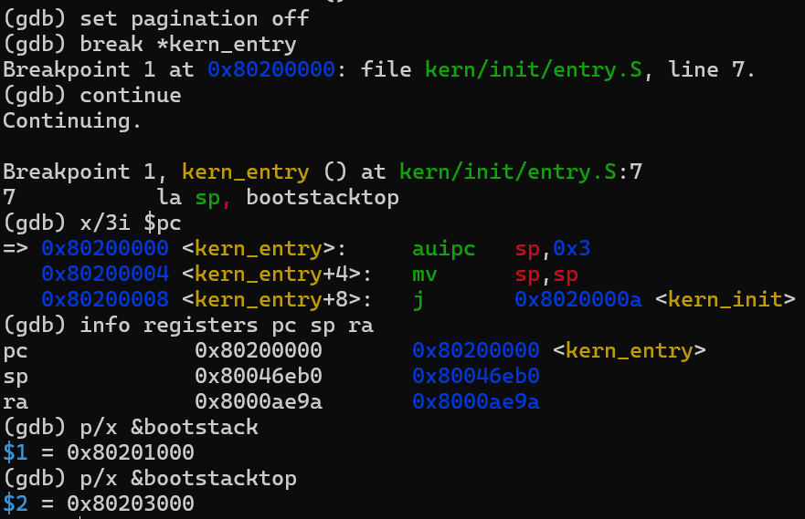

*图 1：断点命中 `kern_entry`，此时尚未执行 `la sp, bootstacktop`。*

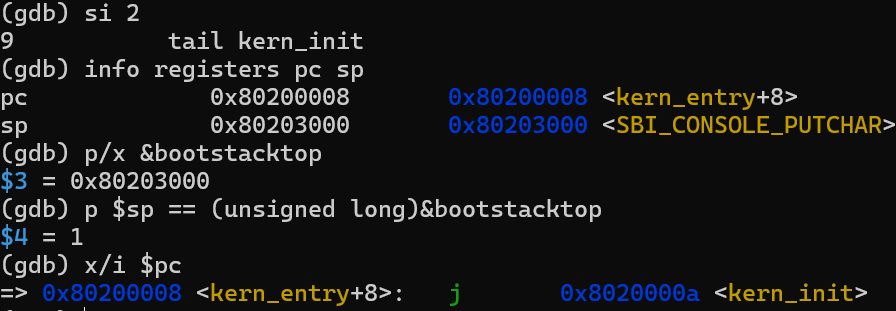

*图 2：执行两条机器指令完成 `la`，比较表达式返回 1。*

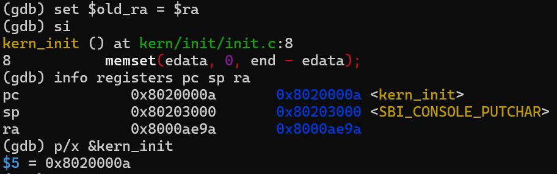

*图 3：跳转后 `pc` 与 `kern_init` 的地址一致，`sp` 仍指向内核栈顶。*

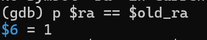

*图 4：比较结果为 1，证明本次尾跳转前后 `ra` 相同。*

**结论：** `la sp, bootstacktop` 将内核启动栈的高地址边界写入栈指针，为后续 C 函数提供对齐、可用的内核栈；`tail kern_init` 把控制权交给 C 初始化函数且不改写 `ra`，完成汇编入口到 C 逻辑的衔接。

---

### 练习二：使用 GDB 验证启动流程

**负责人：** 2412604-刘泽民

#### 调试准备

在 WSL（Ubuntu 24.04）的两个终端中分别执行 `make debug`（`-S` 使 CPU 在执行首条指令前暂停，`-s` 开启 1234 端口 GDB 服务）与 `make gdb`（加载 `bin/kernel` 符号、设置 RV64 架构并连接 QEMU）。连接后 PC 停在 `0x1000`，`??` 表示该地址无内核符号，说明 CPU 尚未运行到内核。

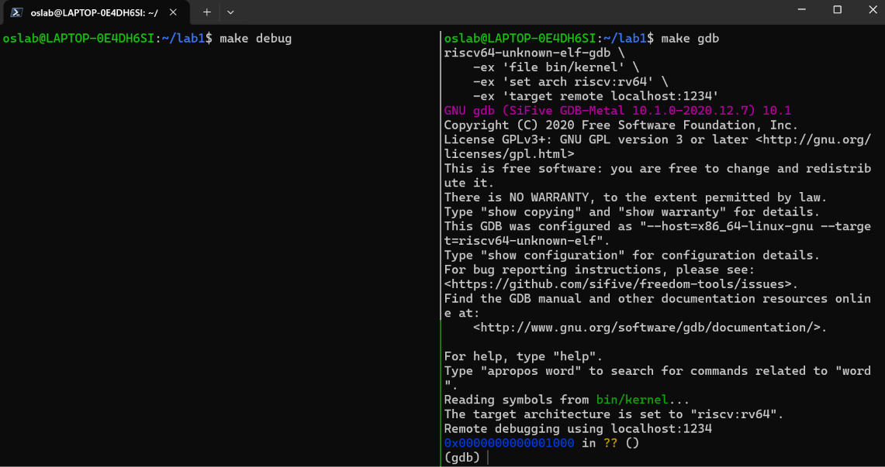

*图 5：GDB 连接成功后停在复位地址 `0x1000`。*

#### 复位阶段的执行路径

先连续单步 `si`，再结合 `i r` 比较寄存器变化。实测执行路径为 `0x1000 → 0x1004 → 0x1008 → 0x100c → 0x1010 → 0x80000000`，前四步 PC 每次加 4，第五步发生跳转。

| 执行次数 | 执行后的 PC | 相比前一步的通用寄存器变化 |
| --- | --- | --- |
| 尚未单步 | `0x1000` | 初始通用寄存器均为 0 |
| 第1次 | `0x1004` | `t0` 从 0 变为 `0x1000` |
| 第2次 | `0x1008` | `a1` 从 0 变为 `0x1020` |
| 第3次 | `0x100c` | 没有观察到通用寄存器数值变化 |
| 第4次 | `0x1010` | `t0` 从 `0x1000` 变为 `0x80000000` |
| 第5次 | `0x80000000` | 通用寄存器保持原值，PC 跳转到新的区域 |

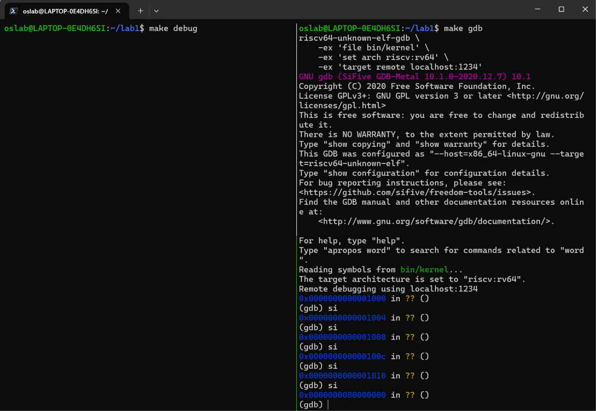

*图 6：连续五次 `si` 后 PC 变化并跳转到 `0x80000000`。*

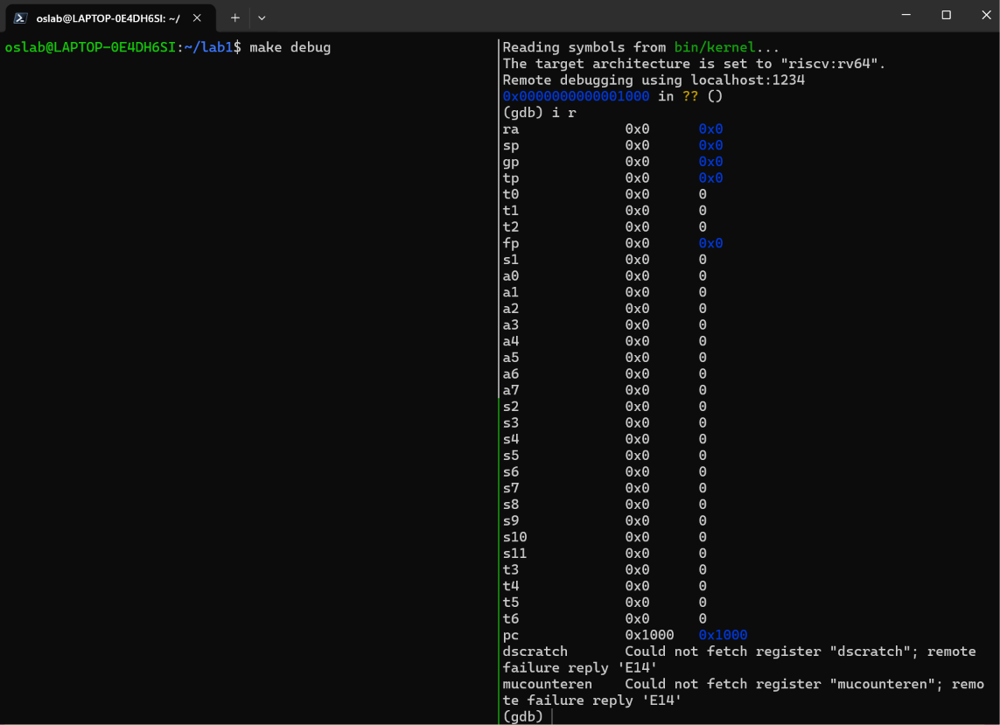

*图 7：初始 `i r` 输出，PC 为 `0x1000`，通用寄存器均为 0。*

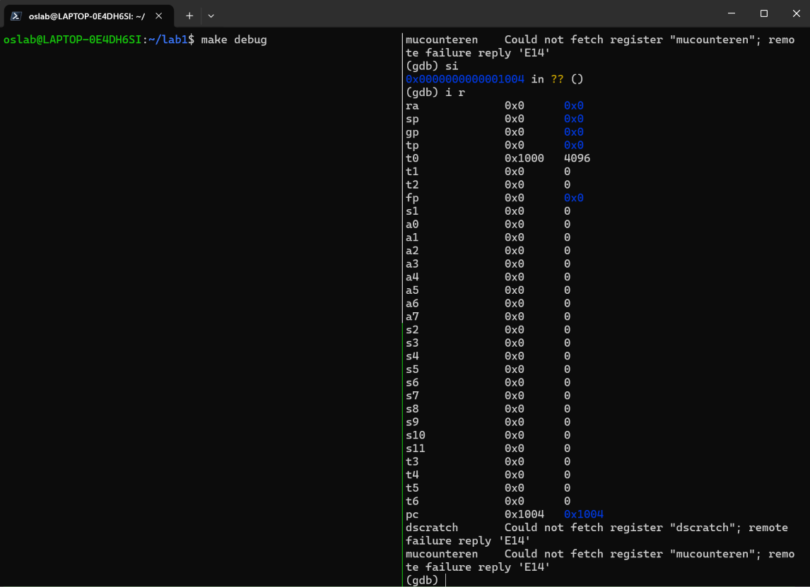

*图 8：第 1 次单步后 PC 为 `0x1004`，`t0` 从 0 变为 `0x1000`。*

#### 反汇编与逐条验证

从复位地址反汇编（`x/6i 0x1000`）得到：

```asm
0x1000: auipc t0,0x0
0x1004: addi  a1,t0,32
0x1008: csrr  a0,mhartid
0x100c: ld    t0,24(t0)
0x1010: jr    t0
0x1014: unimp
```

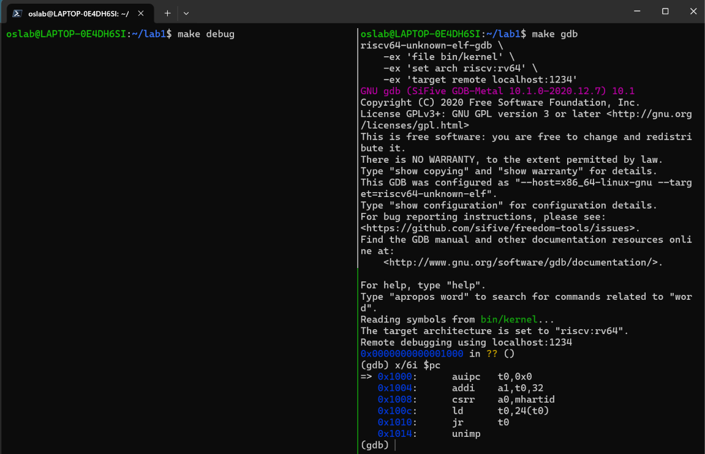

*图 9：从复位地址开始的反汇编结果，`0x1014` 的 `unimp` 不属于已执行的五条指令。*

逐条验证结果：

- **第一条 `auipc t0,0x0`**：立即数为 0，`t0 = 0x1000`，与预期一致。
- **第二条 `addi a1,t0,32`**：`a1 = t0 + 0x20 = 0x1020`；`p/x $a1-$t0` 返回 `0x20`，且 `x/4bx $a1` 读出 `0xd0 0x0d 0xfe 0xed`，说明 `a1` 指向一段实际存在的数据。
- **第三条 `csrr a0,mhartid`**：读取机器级 CSR `mhartid`（当前硬件线程编号）。本次只有 hart 0，读取值与 `a0` 原值同为 0，故看不到数值变化，但读取并写入的操作确实发生了。
- **第四条 `ld t0,24(t0)`**：有效地址 `0x1000 + 24 = 0x1018`，`x/gx $t0+24` 读出 `0x0000000080000000`，执行后 `t0 = 0x80000000`。
- **第五条 `jr t0`**：跳转到 `t0`，GDB 显示停在 `0x0000000080000000`，验证"读取目标地址 → 跳转"。

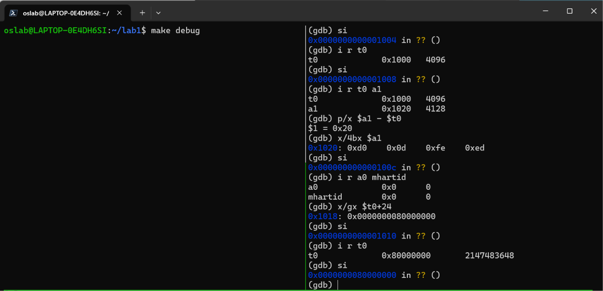

*图 10：依据反汇编检查 `t0`、`a1`、`a0`、`mhartid` 和内存数据，最后跳到 `0x80000000`。*

#### 对照 QEMU 源码理解启动数据

相关说明来自 QEMU 4.1.1 的 `hw/riscv/virt.c`：

```c
[VIRT_MROM] = {     0x1000, 0x11000 },
[VIRT_DRAM] = { 0x80000000,     0x0 },
```

复位向量数组（RV64 分支）前五个元素正是 GDB 中观察到的五条指令，后三个元素保存填充与跳转目标地址 `0x80000000`。整个数组占 `8 × 4 = 32` 字节（`0x20`）。QEMU 把 `reset_vec` 放到 `0x1000`，再把设备树放到 `0x1000 + 0x20 = 0x1020`——这正好解释了 `a1 = 0x1020`。而固件文件名 `opensbi-riscv64-virt-fw_jump.bin` 被加载到 `memmap[VIRT_DRAM].base`（`0x80000000`），因此复位代码跳入的正是 OpenSBI。

| 地址 | 存放的内容 | 与 GDB 结果的关系 |
| --- | --- | --- |
| `0x1000` 起 | 五条复位指令，后接填充和目标地址 | 初始 PC 为 `0x1000` |
| `0x1018` | 跳转目标地址 `0x80000000` | `ld` 读取这个值到 `t0`，随后 `jr` 跳转 |
| `0x1020` 起 | 设备树数据 | `a1 = 0x1020`，指向这份数据 |

#### 内核入口确认控制权交接

在内核入口（`0x80200000`）设置监视点与执行断点后继续运行，命中执行断点（`kern_entry`）。继续运行前内存已含 `0x00003117 0x00010113`；监视点未触发，原因是内核由 QEMU 在 CPU 开始执行前经 `-device loader` 加载，此时设置监视点已无法捕获已发生的加载。

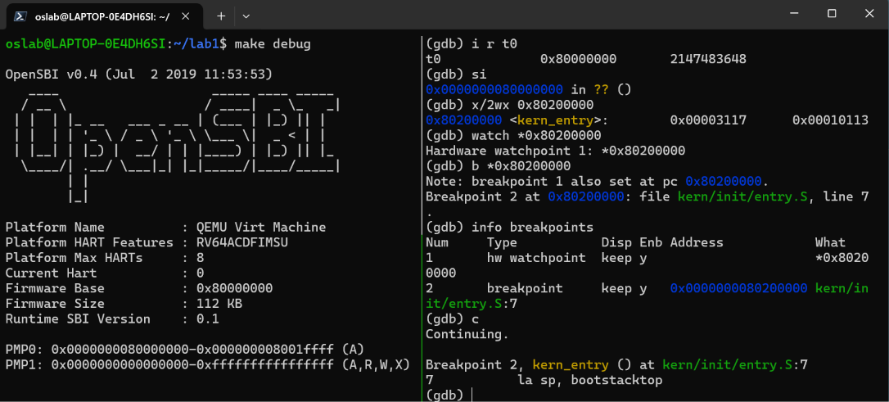

*图 11：左侧为 OpenSBI 输出，右侧命中内核入口断点（本次触发的是执行断点，监视点未触发）。*

停在入口后实测：`pc = 0x80200000`、`sp = 0x8001bd80`、`bootstack = 0x80201000`、`bootstacktop = 0x80203000`；此时 `sp` 仍是进入内核时遗留的值，尚未切换到内核启动栈。执行一次 `si` 后 `pc = 0x80200004`、`sp = 0x80203000`，与内核栈顶一致。

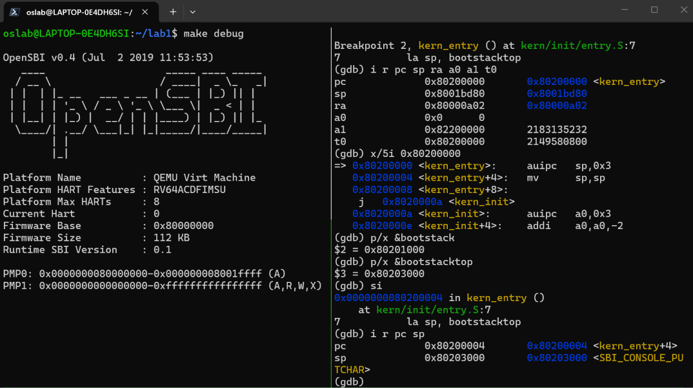

*图 12：内核入口寄存器、反汇编及栈边界；执行一次 `si` 后 `pc = 0x80200004`、`sp = 0x80203000`。*

#### 练习问题答案

**问题一：最初几条指令位于什么地址？** 在本实验的 QEMU 4.1.1 RISC-V `virt` 平台中，CPU 从复位地址 `0x1000` 开始执行，最初五条指令分别位于 `0x1000`、`0x1004`、`0x1008`、`0x100c`、`0x1010`；第五条执行后跳到 `0x80000000`。该复位地址是所用平台的实现，并非所有 RISC-V 硬件都必须采用。

**问题二：它们主要完成哪些功能？** `auipc` 与 `addi` 计算设备树地址 `0x1020` 放入 `a1`；`csrr` 把当前 hart 编号写入 `a0`；`ld` 从 `0x1018` 读取固件入口 `0x80000000`；`jr` 跳转过去进入 OpenSBI。它们完成的是启动参数准备与控制权交接，后续固件初始化及向内核的交接由 OpenSBI 继续完成。

验证得到的启动顺序为：

```text
QEMU 预先加载固件和内核
    ↓
CPU 从 0x1000 执行 ROM 中的复位引导代码
    ↓
准备设备树地址、hart 编号和固件入口
    ↓
跳到 0x80000000，进入 OpenSBI
    ↓
固件初始化后将控制权交给 0x80200000
    ↓
执行内核第一条机器指令，开始建立内核栈
    ↓
进入 kern_init，输出启动消息并进入循环
```

---

## 五、测试与验证

本实验为源码分析与调试验证类实验，核心验证手段是 **GDB 跟踪 QEMU 的启动过程**。由于当前实验环境为 QEMU `virt` 平台，使用的命令为 `make debug`（启动并暂停 QEMU）与 `make gdb`（加载符号并连接）。下面引用两位组员的实测截图作为验证证据：

**（1）复位到固件的验证**（练习二，图 5、图 9、图 10）

GDB 成功连接并停在复位地址 `0x1000`（图 5）；从 `0x1000` 反汇编得到五条复位指令 `auipc / addi / csrr / ld / jr`（图 9）；逐条验证后 PC 跳转到 `0x80000000` 进入 OpenSBI，QEMU 终端输出 `OpenSBI v0.4` 与 `Firmware Base : 0x80000000`，地址吻合（图 10）。

**（2）固件到内核交接的验证**（练习二，图 11、图 12）

在内核入口 `0x80200000` 处命中执行断点，`pc = 0x80200000`，证明控制权已交接到内核（图 11）；执行一次 `si` 后 `pc = 0x80200004`、`sp = 0x80203000`，与内核栈顶一致（图 12）。

**（3）内核入口两条指令的验证**（练习一，图 1–图 4）

`la sp, bootstacktop` 执行后 `sp = 0x80203000 = &bootstacktop`（图 2）；`tail kern_init` 执行后 `pc` 等于 `&kern_init` 且 `ra` 前后不变（图 3、图 4），两条入口指令的行为均与源码分析一致。

> 说明：模板要求的 `make qemu` / `make grade` 输出截图，本组以调试过程截图（`make debug` + `make gdb`）替代。若课程要求补充 `make grade` 得分截图，将截图存为 `images/test_result.png`，并在本节末尾插入 `` 即可。

---

## 六、实验总结与收获

### 对操作系统的理解

#### 本实验中的重要知识点及其与 OS 原理知识点的关系

下表列出本实验涉及的重要知识点，并对照操作系统原理中的对应概念。

| 本实验知识点 | OS 原理知识点 | 二者的含义、关系与差异 |
|------|------|------|
| **内核启动栈的建立**（`la sp, bootstacktop`） | **栈与函数调用约定**；进程/线程的内核栈 | 含义：C 函数运行需要栈保存返回地址、寄存器与局部变量。关系：本实验是"栈"这一机制在最底层的自举案例。差异：本实验的启动栈只有一份、在 `.data` 段静态预留于固定地址；OS 原理中每个进程/线程各有独立内核栈，随创建动态分配、随上下文切换复用。 |
| **尾调用移交控制权**（`tail kern_init`，不改写 `ra`） | **函数调用/返回地址**；进程上下文切换 | 含义：`ra` 决定函数返回位置。关系：都是"控制流的转移"。差异：OS 原理中的上下文切换要保存/恢复**完整**上下文（`ra`、`sp`、通用寄存器、PC）；`tail` 只是单次控制转移，还刻意丢弃返回点。 |
| **链接地址与加载**（`BASE_ADDRESS=0x80200000`、QEMU `-device loader`） | **程序装入/加载器、地址重定位、ELF 格式** | 含义：可执行文件如何被放到内存中正确位置运行。关系：本实验是"内核被装入固定物理地址运行"的实例。差异：OS 原理中加载用户程序涉及页表映射到进程虚拟地址空间、按需分页与动态重定位；本实验是裸机定址链接、尚未启用 MMU。 |
| **BSS 段清零**（`memset(edata, 0, end-edata)`） | **程序段布局与地址空间初始化**（`.text/.data/.bss`） | 含义：`.bss` 存放未初始化/初值为 0 的全局变量，需在使用前清零。关系：都是"保证静态变量初值正确"。差异：OS 原理中由内核在创建进程时清零用户程序的 `.bss`；本实验是内核给自己的 `.bss` 清零。 |
| **固件与 SBI 调用**（OpenSBI、`sbi_console_putchar`） | **引导链（firmware/bootloader）与特权级**（M 态/S 态、用户态/内核态） | 含义：固件运行在最高特权级，向内核提供底层服务。关系：SBI 是"内核向固件请求服务"的接口，是特权级分层思想的体现。差异：OS 原理的引导链关注"把 OS 加载起来"，而这里的 SBI 还提供**运行时**服务（如早期控制台输出）。 |
| **复位向量与 PC 初值**（复位 PC = `0x1000`） | **CPU 复位、中断/异常入口** | 含义：硬件复位后从固定地址取指开始执行。关系：都体现"CPU 从约定地址进入处理流程"。差异：复位是上电后的入口；中断/异常入口是运行期间在特定事件下被跳转到的处理入口。 |

#### OS 原理中很重要、但本实验没有对应上的知识点

本实验停留在"内核刚刚启动、尚未建立任何子系统"的最早期阶段，因此以下 OS 原理的重要内容没有在本实验中体现：

1. **进程/线程管理与调度**：实验中没有进程、PCB、就绪/运行队列、时间片或调度算法，`kern_init` 最后只是 `while(1)` 空循环。
2. **中断与异常处理**：没有 trap 入口、时钟中断、缺页异常或系统调用处理流程；内核尚未注册任何中断向量。
3. **虚拟内存与分页**：尚未启用 MMU，没有页表、地址翻译、缺页处理；内核直接运行在物理地址 `0x80200000`，访问的是物理内存。
4. **用户态与内核态边界、系统调用接口**：本实验全程在内核态，没有用户进程，也没有"用户态经系统调用陷入内核"的路径（`sbi_*` 是内核调用固件，不是用户调用内核）。
5. **内存管理与动态分配**：没有物理页分配器、`kmalloc`/`kfree`；启动栈是静态预留的，没有动态内存管理。
6. **文件系统与设备驱动**：没有文件系统、块设备或完整的字符设备驱动，控制台输出是借助固件的 SBI 服务完成的。
7. **并发与同步**：没有锁、信号量、原子操作或多核同步；本实验仅涉及单 hart 的顺序启动。

这些内容通常在本课程后续实验中陆续引入，本实验的作用是为它们准备好一个"能跑起来的"最小内核。

### AI 协作开发的经验

在本次实验中，我们主要用 AI 工具辅助**阅读和验证底层启动代码**，而不是生成大段代码，几点体会如下：

把 AI 当作"解释器"比当作"写手"更有价值。启动流程涉及链接脚本、汇编伪指令、QEMU 平台细节和 GDB 输出，信息分散且术语密集；让 AI 逐条解释 `la`/`tail` 的展开、`reset_vec` 数组布局、`a1=0x1020` 的来龙去脉，比让它直接给出结论更可靠。

数值和地址必须自己用 GDB 复核。AI 对"某条指令把哪个寄存器改成多少"这类问题可能给出看似合理但实际错误的结果，例如 `mv sp,sp` 是否改变数值、`csrr` 为何看不到变化，都要结合 `i r`、`p/x` 实测才能确认。

提示词要带上"证据"。当把 GDB 的真实输出（寄存器、反汇编、内存值）作为上下文贴给 AI 时，得到的分析明显更准确；只给一句笼统的问题，回答往往泛泛而谈。

最终的判断权在人。AI 帮助我们快速建立框架、排查歧义，但哪条结论成立、哪张截图能作为证据，仍需要我们自己在实验环境中验证后拍板。

---
